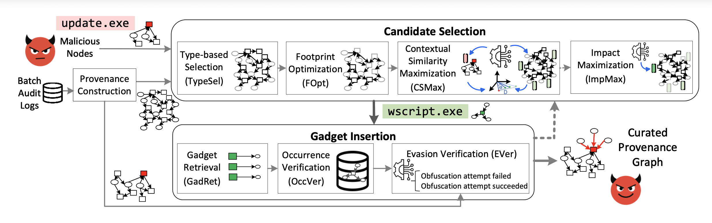

# Contorter 

This repository contains the official implementation and analysis notebooks for 

**Contorter: "A Context is Worth a Thousand Lies: Evading Intrusion Detectors via Intelligent Context Distortion"**.  
To apprear at the 47th IEEE Symposium on Security and Provacy.

Contorter is an evasion framework that generates *contextually-relevant* gadget events to hide malicious nodes from node-level provenance-based intrusion detection systems (PIDSes). The notebooks reproduce the evasion experiments against four PIDSes (**Flash**, **Magic**, **NodLink**, **Threatrace**). 



***

## Repository Structure

```plaintext
README.md
<PIDS Name>/
├─ README.md
├─ requirements.txt
├─ <Dataset Name>/
│  └─ notebooks and dependencies to run the experiments
```
The above structure is used for each evaluated PIDS: Flash, Magic, NodLink, Threatrace.

## Threat Model

**White-box:** We assume attackers can access or infer host audit data, know the malicious nodes of their attack, and understand the architecture of the target PIDS (e.g., via logs or training a surrogate model), allowing them to apply all Contorter steps including candidate node selection, similarity verification, and interaction injection while ensuring the attack objective is preserved.

**Black-box:** We assume attackers can access or infer host audit data and know the malicious nodes of their attack but have no knowledge of the deployed PIDS, embeddings, or detection confidence and cannot query the model, allowing them to apply Contorter’s graph manipulation steps (e.g., Type-based Selection (TypeSel) and Footprint Optimization (FOpt)) without iterative verification of evasion success.

**Implementation Note:**  
The provided codebase implements the **white-box evasion setting**. To adapt the pipeline for a **black-box scenario**, restrict the attack to only the **Type-based Selection (TypeSel)** and **Footprint Optimization (FOpt)** steps and disable the steps that rely on model knowledge or embedding-based similarity verification.

## 
