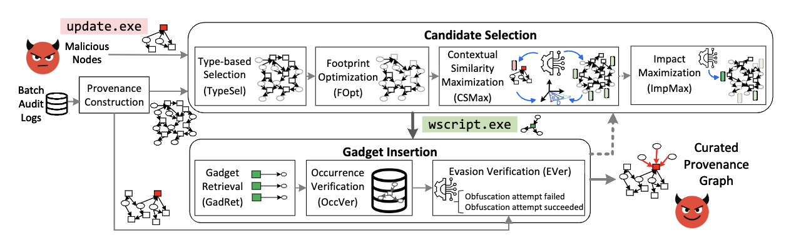

# Contorter 

This repository contains the official implementation and analysis notebooks for **Contorter: A Context is Worth a Thousand Lies: Evading Intrusion Detectors via Intelligent Context Distortion**.  
Contorter is an evasion framework that generates *contextually-relevant* gadget events to hide malicious nodes from node-level provenance-based intrusion detection systems (PIDSes). The notebooks reproduce the evasion experiments we ran against the **Flash** PIDS implementation and the DARPA E3 partitions used in our evaluation.



***

## How Contorter Leverages Flash's Code in Provenance Construction 

We reuse Flash’s preprocessing and graph-construction modules to ensure full compatibility with the Flash pipeline:

1. **Preprocessing** — convert raw JSON logs into the text files used for training (benign behavior) and testing (benign + malicious) using Flash’s preprocessing scripts.  
2. **Provenance construction** — run Flash’s provenance-builder 
3. **Contorter pipeline** — once graphs are constructed in Flash’s format, apply Contorter’s modules to select candidate nodes, retrieve and verify gadgets, and inject mimicry interactions. Evaluate detection metrics before and after injection to measure evasion effectiveness.


## Repository Structure

```plaintext
README.md
requirements.txt
Contorter on Flash PIDS/
  ├─ CADETS/
  │   └─ FLASH_CADETS.ipynb
  ├─ THEIA/
  │   └─ FLASH_THEIA.ipynb
  └─ TRACE/
      └─ FLASH_TRACE.ipynb
```

| Notebook Path                                       | Dataset | Description                                                                          |
| --------------------------------------------------- | ------- | ------------------------------------------------------------------------------------ |
| `Contorter_on_Flash_PIDS/CADETS/FLASH_CADETS.ipynb` | CADETS  | Reproduces Contorter experiments using the CADETS Dataset. |
| `Contorter_on_Flash_PIDS/THEIA/FLASH_THEIA.ipynb`   | THEIA   | Reproduces Contorter experiments on the THEIA Dataset.                             |
| `Contorter_on_Flash_PIDS/TRACE/FLASH_TRACE.ipynb`   | TRACE   | Reproduces Contorter experiments on the TRACE Dataset.                             |

## What Each Notebook Demonstrates

1. Provenance graph loading and preprocessing.
2. Execution of Contorter’s core modules — **TypeSel → FOpt → CSMax → GadRet → OccVer → EVer → ImpMax**.
3. Gadget application and context manipulation.
4. Evaluation using **Flash** evaluation metrics for fair comparison and reporting before/after evasion metrics (recall, FPR, etc.).

---

## Quick Start

### 1. Clone the Repository
```bash
git clone <this-repo-url>
cd Contorter on Flash PIDS/
````

### 2. Create and Activate a Python Environment

```bash
python -m venv .venv
source .venv/bin/activate     
venv\Scripts\activate
pip install -r requirements.txt
```

### 3. Launch Jupyter

```bash
jupyter lab
# or
jupyter notebook
```

Then open the desired notebook (e.g., `Contorter on Flash PIDS/FLASH_CADETS.ipynb`) and execute the cells sequentially.

---
**Note:** Additional provenance-based intrusion detection systems (PIDS) and datasets used in this work will be made publicly available once the associated paper is accepted.
---

## Code Attribution

Portions of this implementation build upon the **Flash** provenance-based intrusion detection system (PIDS).

> **Citation:**  
> Rehman, Muhammad Umer; Ahmadi, Hossein; and Hassan, Wajih Ul.  
> *A Context is Worth a Thousand Lies: Evading Intrusion Detectors via Intelligent Context Distortion.*  
> *In Proceedings of the 2024 IEEE Symposium on Security and Privacy (SP),* pp. 3571–3586. IEEE, 2024.  
> [https://github.com/DART-Laboratory/Flash-IDS](https://github.com/DART-Laboratory/Flash-IDS)

<details>
<summary>BibTeX Reference</summary>

```bibtex
@inproceedings{rehman2024contorter,
  title={A Context is Worth a Thousand Lies: Evading Intrusion Detectors via Intelligent Context Distortion},
  author={Rehman, Muhammad Umer and Ahmadi, Hossein and Hassan, Wajih Ul},
  booktitle={2024 IEEE Symposium on Security and Privacy (SP)},
  pages={3571--3586},
  year={2024},
  organization={IEEE}
}
```


